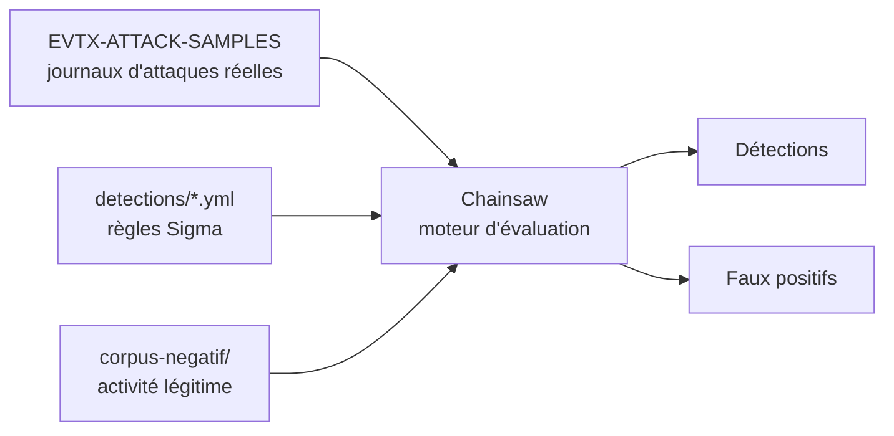

# 05 — Logs Windows : detection engineering hors ligne

> **Statut :** brouillon · **Coût :** nul · **Durée de montage :** ~10 min
> **ATT&CK :** T1105 — Ingress Tool Transfer · T1218.010 — Signed Binary Proxy Execution

## 1. Objectif

Écrire et calibrer une règle Sigma pour Windows sans jamais démarrer une machine
Windows. Le module rejoue des journaux d'événements réels (EVTX) capturés lors
d'attaques documentées, et mesure la détection contre eux.

## 2. Prérequis

| Ressource | Besoin |
| --- | --- |
| RAM | négligeable (aucun service) |
| Disque | ~2 Go (échantillons EVTX + règles Sigma) |
| Durée de montage | ~10 min, dominée par les téléchargements |
| Dépendances | `bash`, `curl`, `git`, `python3`, GNU Make |

Aucun conteneur, aucun SIEM, aucun port ouvert. Sous Windows, lancer le module
depuis WSL : les scripts sont POSIX.

## 3. Architecture

Il n'y a pas d'infrastructure — seulement une chaîne de traitement. C'est tout
l'intérêt : le travail de detection engineering est identique, le coût est nul.



Chainsaw applique les règles Sigma aux journaux via un fichier de *mapping* qui
traduit les champs Sigma en champs EVTX. Ce mapping est fourni avec Chainsaw.

## 4. Montage

```bash
cd modules/05-windows-logs
make up        # Chainsaw + règles Sigma + échantillons EVTX
make samples   # lister les journaux disponibles
```

## 5. Scénario d'attaque

**L'attaque n'est pas exécutée ici** — c'est le compromis central du module.
Elle a été exécutée par un tiers sur une vraie machine, et ce qu'on rejoue est
sa télémétrie. Le scénario est donc parfaitement reproductible, mais figé : on
ne peut pas en faire varier les paramètres. C'est le premier angle mort
(section 10).

```bash
make attack                  # motif par défaut : certutil
make attack PATTERN=mimikatz # n'importe quelle autre technique du corpus
```

[`attack/replay.sh`](attack/replay.sh) sélectionne les journaux correspondants
et les copie dans `work/`.

## 6. Ce que je vois

> **À rédiger après exécution.** Coller ici les événements bruts observés dans
> l'échantillon : `EventID`, `Image`, `CommandLine`, `OriginalFileName`,
> `ParentImage`. Identifier quels champs distinguent réellement l'exécution
> malveillante d'un usage normal — c'est ce constat qui justifie la règle de la
> section 7, pas l'inverse.

## 7. La détection

Règle de départ : [`detections/certutil_download.yml`](detections/certutil_download.yml).

Le raisonnement retenu, à confirmer par l'observation de la section 6 :
`Image|endswith` seul tombe au premier renommage du binaire, d'où l'ajout
d'`OriginalFileName`, que Sysmon extrait des métadonnées du fichier. Les deux
sont conservés car `OriginalFileName` n'est pas toujours peuplé selon la
configuration Sysmon en place.

> **À compléter.** Expliquer pourquoi ces champs et pas d'autres, et quelles
> variantes de la technique la règle couvre — ou ne couvre pas.

## 8. Validation

```bash
make verify
```

Le contrôle est en deux temps : la règle doit se déclencher sur le scénario,
**et** rester silencieuse sur le corpus d'activité légitime.

> **À rédiger.** Coller la sortie réelle de `make verify`.

## 9. Faux positifs observés

> **À rédiger — section la plus importante du module.** Elle exige de constituer
> `corpus-negatif/` depuis une machine Windows au repos (voir
> [`detections/README.md`](detections/README.md)). Sans ce corpus, on ne sait
> rien du bruit de la règle, et `make verify` le signale explicitement.

| Source de bruit | Contexte | Traitement retenu |
| --- | --- | --- |
| | | |

## 10. Angles morts

Trois sont déjà identifiables avant même de lancer le module :

- **Le scénario est figé.** On observe une exécution particulière de la
  technique, pas la technique. Une variante non présente dans le corpus est
  invisible ici.
- **La télémétrie est celle d'un tiers.** La configuration Sysmon de la machine
  d'origine détermine quels champs existent. Une règle qui fonctionne sur ces
  journaux peut échouer sur un parc réellement configuré autrement.
- **Aucune notion de temporalité.** Chainsaw évalue chaque événement isolément :
  tout ce qui relève de la corrélation ou du volume échappe à ce montage.

> **À compléter** après observation : variantes testées et non détectées,
> contournements connus de la règle.
