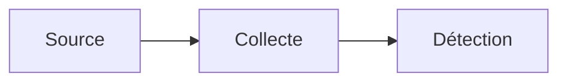

# NN — Titre du module

> **Statut :** brouillon · **Coût :** nul / léger / moyen · **Durée de montage :** ~N min
> **ATT&CK :** TXXXX.XXX — Nom de la technique

<!--
GABARIT IMPOSÉ — les dix titres `## N. ...` ci-dessous sont vérifiés par la CI
(`python tools/check_structure.py`). Ne pas les renommer, ne pas en retirer,
ne pas changer leur ordre. Tout le reste est libre.
-->

## 1. Objectif

La question à laquelle ce module répond, en deux phrases. Écrire cette section
*avant* de monter quoi que ce soit : si la question n'est pas claire, le module
n'est pas prêt.

## 2. Prérequis

| Ressource | Besoin |
| --- | --- |
| RAM | X Go |
| Disque | X Go |
| Durée de montage | X min |
| Dépendances | docker, ... |

Tout ce qu'un tiers doit avoir pour rejouer le module. Si ce n'est pas listé
ici, le module n'est pas reproductible.

## 3. Architecture

Un schéma des composants et des flux — même simple. Un lecteur doit comprendre
le montage sans ouvrir le code.



## 4. Montage

Les commandes exactes, testées, dans l'ordre.

```bash
make up
```

## 5. Scénario d'attaque

Script versionné et rejouable (`attack/`), **pas** une manipulation manuelle.
Décrire ce que fait le script et pourquoi cette variante de la technique.

```bash
make attack
```

## 6. Ce que je vois

Les traces brutes : extraits de logs, champs qui bougent, avant/après. Coller de
vrais extraits depuis `evidence/`, pas une description théorique.

```
<extrait de log réel>
```

## 7. La détection

La règle (`detections/`) **et surtout le raisonnement qui y mène** : quel champ
est réellement discriminant, pourquoi celui-là, quelles variantes il couvre.
Le raisonnement vaut plus que la règle.

## 8. Validation

La preuve que la détection se déclenche sur le scénario.

```bash
make verify
```

```
<sortie de la validation>
```

## 9. Faux positifs observés

Ce qui s'est déclenché à tort, dans quel contexte, et ce que ça implique pour le
seuil ou le filtrage. Une détection non calibrée est une détection inutile.

| Source de bruit | Contexte | Traitement retenu |
| --- | --- | --- |
| | | |

## 10. Angles morts

Ce que ce montage **ne voit pas**, et ce qu'il faudrait pour le voir : variantes
de la technique non couvertes, télémétrie manquante, contournements connus.
